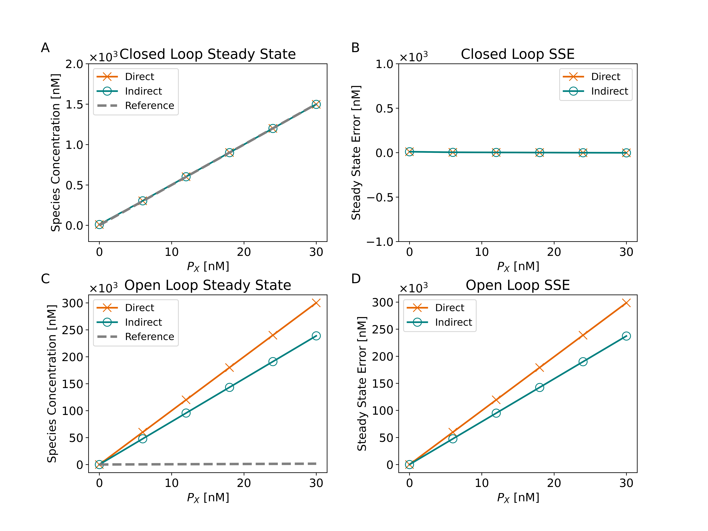

# Temperature Dependence of RNA Control Architecture Steady State Error
A repository for the final project for Systems Biology (BIO520) at Colorado School of Mines  

The paper used to focus the project is:  
  
Agrawal, D. K.; Tang, X.; Westbrook, A.; Marshall, R.; Maxwell, C. S.; Lucks, J.; Noireaux, V.; Beisel, C. L.; Dunlop, M. J.; Franco, E. Mathematical Modeling of RNA-Based Architectures for Closed Loop Control of Gene Expression. ACS Synth. Biol. 2018, 7 (5), 1219–1228. https://doi.org/10.1021/acssynbio.8b00040.

### Temperature Dependence of Kinetic Parameters

*Figure 1. Temperature dependence on the kinetic parameters used in each control architecture. The reference temperature is taken to be 25C. The random range explored refers roughly to the parameter range explored by Agrawal et al. through random sampling of +/- 1 order of magnitude. The RNA denaturation window is set arbitrarily at 65C, experimentally determined values range from ~55-70C.*

References for the activation energies are taken from:  
  
Becskei, A.; Rahaman, S. The Life and Death of RNA across Temperatures. Computational and Structural Biotechnology Journal 2022, 20, 4325–4336. https://doi.org/10.1016/j.csbj.2022.08.008.

### Results  

*Figure 2. Full solution to the system of ODES defined for each controller at initial conditions XYZ.*
  

*Figure 3. Controller response for each system of ODES defined for each controller at initial conditions XYZ. Compare to Agrawal et al. Figure 1 d-f.*

*Figure 4. Reproduction of Agrawal Figure 2 a-b.*

*Figure 5. Temperature Dependence of the Steady State Error.*

# GAME PLAN
Here's the plan for Tuesday:
1) Write a function that returns the solution to each controller architecture ODEs over time. We will simulate over 10 hours to reproduce the time based solution in Figure 1.
The resulting equations will take the temperature and initial concentrations as inputs.
2) Draft analysis code to compute the steady state error given the time series. This code will also make standardized plots.
